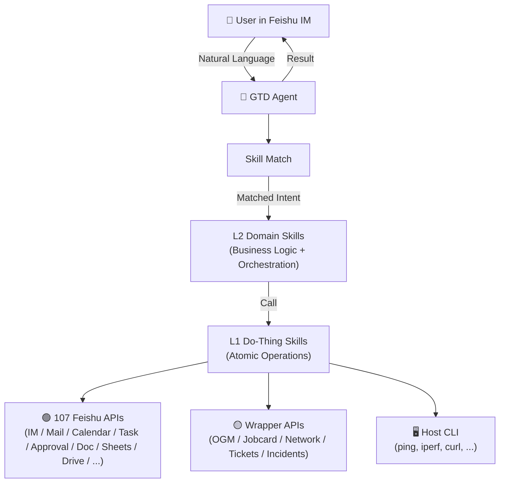

# GetThingsDone (GTD)

> An AI agent that runs on your Mac, lives in your IM, and gets your daily IT operations done. So you don't have to.

**2026 AI Competition · Team PatternMaker**

---

## What is GTD?

GTD turns your AI from a thinker into a doer.

| Before | After |
|--------|-------|
| You ask ChatGPT → it tells you how → you still do the work | You ask GTD → it does the work → you get the result |

Built on OpenClaw and integrated with Feishu's full API surface (107 real skills), GTD automates routine IT operations through natural language conversations in your IM.

---

## Team

| Role | Member |
|------|--------|
| **Lead** — Architecture, Agent Core, Roadshow | Yuchen Zhang |
| Domain Knowledge Providers | Allen Zhou, Daniel Hu, Qingquan Gu, Robinson Zhang, Shenwei Jiang, Kenny Lin X |

---

## MVP (3 Scenarios)

1. **Spare Parts Management** — Inventory visibility → replenishment planning → OGM funding check → procurement execution
2. **Jobcard Management** — Daily team load overview, vacation awareness, task assignment, blocked/unrefined work detection
3. **Real-time Network Status & Operations Report** — Network health across wired/wireless/leased-line/overseas, incidents, changes, special events → report via IM → email archive

See [MVP.md](./MVP.md) for details.

---

## Architecture

### Two-Layer Skill Model

| Layer | Type | Responsibility | Who Builds |
|-------|------|---------------|------------|
| **L1** Do-Thing | Execution | Atomic operations: send message, query system, create ticket… | Yuchen (infrastructure) |
| **L2** Domain | Orchestration | Business logic: know what to do and in what order | Team members (domain expertise) |

**Principle:** L1 never contains business judgment. L2 never directly touches external systems.

---

## Tech Stack

- **Platform:** [OpenClaw](https://openclaw.ai) — Skill registry, LLM gateway, IM routing
- **LLM:** DeepSeek v4 Pro
- **IM:** Feishu (107 real API skills, full surface)
- **MaaS:** TBD
- **Deploy:** macOS (dev) → Docker (target)

---

## Three Execution Modes

| Mode | Trigger | Example |
|------|---------|---------|
| **On-demand** | User asks in IM | "How's the network latency now?" |
| **Scheduled** | Cron / timer | "Send network report every morning at 9" |
| **Event-driven** | External event | "Alert me when a new incident is declared" |

---

## Project Status

| Module | Status |
|--------|--------|
| Feishu L1 Skills (107) | ✅ Live |
| Non-Feishu Skills (Gmail) | ✅ Live |
| Agent Framework (OpenClaw) | ✅ Live |
| Wrapper APIs (11 for MVP) | ⏳ Pending |
| L2 Domain Skills (3 for MVP) | ❌ To build |
| O2 Presentation | ⏳ Pending |
| Docker Containerization | ⏳ Post-MVP |

---

## Getting Started

> Development setup guide coming soon.

Prerequisites:
- macOS (Apple Silicon)
- Node.js 22+
- Feishu bot with admin permissions
- OpenClaw installed

---

## Documents

- [Planning & Design](./planning.md) — Full project plan, 10 use cases, architecture decisions
- [MVP Definition](./MVP.md) — Three MVP scenarios with detailed L1 skill mapping
- [L1 Skills Catalog](./l1-skills-list.md) — Complete inventory of 141 L1 skills

---

## Philosophy

> PatternMaker: Eliminate repetition at its source.
